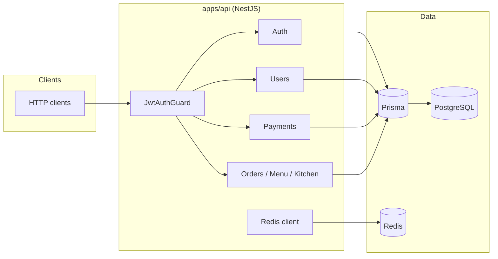

<div align="center">

# Kiosk System

**Multi-branch restaurant & retail backend** — orders, menus, kitchen, and payments behind a single NestJS API with **JWT-scoped tenants**, **Prisma**, and **PostgreSQL**.

[](https://nodejs.org/)
[](https://nestjs.com/)
[](https://www.prisma.io/)
[](https://www.postgresql.org/)
[](https://redis.io/)
[](https://docs.docker.com/compose/)
[](LICENSE)
[](.github/workflows/ci.yml)

</div>

---

## Table of contents

- [Why this project](#why-this-project)
- [Architecture](#architecture)
- [Tech stack](#tech-stack)
- [Getting started](#getting-started)
  - [Docker (recommended)](#docker-recommended)
  - [Local development](#local-development)
- [Authentication](#authentication)
- [Caching and rate limiting](#caching-and-rate-limiting)
- [API reference](#api-reference)
- [Repository layout](#repository-layout)
- [Design intent & scope](#design-intent--scope)
- [Scripts](#scripts)
- [License](#license)

---

## Why this project

This codebase is built to read like **production-shaped backend work**: clear boundaries between branches (tenants), predictable HTTP semantics (`400` / `404` / `409`), and **transactional** payment handling with an optional **idempotency** hook — without pretending to integrate a real card network.

| | |
| :--- | :--- |
| **Multi-tenant by design** | Users and payments are scoped to a `branchId` carried in the JWT. |
| **Safety over demos** | Passwords hashed with bcrypt; duplicate logins rejected with **409**. |
| **Payments you can reason about** | Amount checks, status gates, double-payment prevention, atomic Prisma transactions. |
| **Ops-ready baseline** | Docker Compose for API + Postgres + **Redis**, Prisma migrations, GitHub Actions CI, ESLint (lint targets `src/`; build output under `dist/` is ignored). |

---

## Architecture



---

## Tech stack

| Layer | Choice |
|--------|--------|
| Runtime | **Node.js 22** |
| Framework | **NestJS 11** |
| Data access | **Prisma 5** |
| Database | **PostgreSQL 16** |
| Cache / sessions (optional) | **Redis 7** via **ioredis** — enabled when `REDIS_URL` is set |
| Packaging | **npm workspaces** monorepo |
| Local / demo infra | **Docker Compose** (API + Postgres + Redis) |

**Requirements:** Node.js 22 + npm, and either PostgreSQL locally **or** Docker only. **Redis** is optional for local runs (omit `REDIS_URL`); Docker Compose starts Redis and sets `REDIS_URL` for the API.

---

## Getting started

### Docker (recommended)

Credentials in `docker-compose.yml` are for **development** — change them before any real deployment.

```bash
cp .env.example .env
# If Postgres runs in Docker, set DATABASE_URL in .env to match docker-compose.yml.
docker compose up --build
```

| Service | URL / port |
|---------|------------|
| API | `http://localhost:3000` |
| PostgreSQL | `localhost:5432` — user `kiosk`, password `kiosk`, database `kiosk` |
| Redis | `localhost:6379` (Compose sets `REDIS_URL=redis://redis:6379` inside the API container) |

### Local development

1. **Install** (from the repository root):

   ```bash
   npm install
   ```

2. **Environment**

   ```bash
   cp .env.example .env
   ```

   Point `DATABASE_URL` at your PostgreSQL instance. Optionally set `REDIS_URL` (e.g. `redis://localhost:6379`) if you run Redis locally; otherwise the API skips Redis and logs a one-time warning.

3. **Migrations** — schema ships as a single **`init`** migration; apply after Postgres is up:

   ```bash
   npx prisma migrate deploy
   ```

   During schema work: `npx prisma migrate dev`.

4. **Run the API**

   ```bash
   cd apps/api && npm run start:dev
   ```

   `main.ts` loads `.env` from the **repository root** — keep `.env` there even when starting from `apps/api`.

---

## Authentication

- Most routes expect **`Authorization: Bearer <access_token>`**.
- **Public:** `GET /`, `GET /health` (includes Redis status), `POST /auth/login`.
- **Login body:** `branchCode` (matches branch `code`), `loginName`, `password` (≥ 6 characters).
- **`loginName`** is unique per branch; passwords stored with **bcrypt**.
- After migration, existing users may get a temporary password **`changeme`** — **replace in production**.

---

## Caching and rate limiting

| Concern | Behavior |
|---------|----------|
| **HTTP cache** | `GET /categories` list responses are cached for **`HTTP_CACHE_TTL_MS`** (default **30000** ms). With `REDIS_URL`, storage uses **Keyv + Redis** (`@keyv/redis`); without it, **in-memory** only. |
| **Rate limits** | Global **`ThrottlerGuard`**: **`THROTTLE_LIMIT`** requests per **`THROTTLE_TTL_MS`** window per IP. **`POST /auth/login`** uses **`THROTTLE_LOGIN_LIMIT`** in the same window. **`GET /`** and **`GET /health`** skip throttling (`@SkipThrottle`). |
| **Distributed limits** | When Redis is enabled, throttling uses **`@nest-lab/throttler-storage-redis`** with the **`ioredis`** instance from `RedisService` — counters are shared across API replicas. Response cache uses a **separate** Redis connection via **Keyv** (`@keyv/redis`). |
| **Login route** | `POST /auth/login` uses **`@CustomThrottle`** with pairs like `[Cfg.limit.login, 10]` and `[Cfg.ttl.ms, 60_000]` (see `src/config/cfg-keys.ts`). |

**Env (see `.env.example`):** `TRUST_PROXY` (`1` = first hop, `true` = trust all), `HTTP_CACHE_TTL_MS`, `THROTTLE_TTL_MS`, `THROTTLE_LIMIT`, `THROTTLE_LOGIN_LIMIT`. Key names are centralized in **`Cfg`** (`apps/api/src/config/cfg-keys.ts`) to avoid typos.

---

## API reference

### Health — `GET /health` (public)

Returns `{ status: 'ok', redis: { enabled, ok } }`. When `REDIS_URL` is unset, `enabled` is `false`. When Redis is configured, `ok` reflects a successful `PING`.

### Users — `/users` (JWT required)

| Method | Path | Access | Description |
|--------|------|--------|-------------|
| `GET` | `/users` | Same branch | List; optional `?branchId=` must match the token branch |
| `GET` | `/users/:id` | Same branch | Detail |
| `POST` | `/users` | **ADMIN** | Create; body: `name`, `loginName`, `password`, `role`, `isActive?` — duplicate `loginName` → **409** |
| `PUT` | `/users/:id` | **ADMIN** | Update `name`, `role`, `isActive`, `password?` |
| `DELETE` | `/users/:id` | **ADMIN** | Soft delete (`deletedAt`) |

### Payments — `POST /payments/:orderId/process` (JWT required)

There is **no** real PSP or card gateway here — the emphasis is **domain rules**, **consistency**, and **clear failure modes** (useful for portfolios and technical interviews).

| Rule | Behavior |
|------|----------|
| Branch isolation | Order must match JWT `branchId`; else **404** |
| Order status | Pay only when order is **CREATED**; else **400** |
| Amount | `amount` must equal order `totalAmount` (Decimal); else **400** |
| Double pay | Existing successful payment → **409** |
| Atomicity | Payment insert + order `PAID` + `paidAmount` in one **transaction** |
| Idempotency (optional) | `idempotencyKey` — same `reference` returns the **same** successful row |
| Beyond this repo | Webhooks, PSP signatures, `SERIALIZABLE` tuning — **out of scope** |

**Body:** `provider`, `amount`, optional `idempotencyKey`.

---

## Repository layout

| Path | Role |
|------|------|
| `apps/api` | NestJS application |
| `apps/api/src/config` | `cfg-keys.ts` (`Cfg` env key map), `env.ts` helpers (`envInt`, `envTrustProxy`) |
| `apps/api/src/redis` | Global `RedisModule` / `RedisService` (`ioredis`) |
| `apps/api/src/common/decorators` | `custom-throttle.decorator.ts`, `Public`, `CurrentUser`, etc. |
| `prisma` | Schema and SQL migrations |

---

## Design intent & scope

The goal is to demonstrate **mid-level backend signals**: multi-tenant data boundaries, JWT + branch scoping, user lifecycle with **409** on conflicts, payment flows with **transactions** and **optional idempotency**, **Redis** wired for caching / rate limiting / pub-sub as you grow, plus **Docker** and **CI**. A live payment provider and full production operations are **intentionally** left as roadmap items — say so explicitly in interviews.

---

## Scripts

Run from the **repository root**:

| Command | Purpose |
|---------|---------|
| `npm run lint` | ESLint on `apps/api/src` (same as CI; `dist/` / `coverage/` ignored by config) |
| `npm run build` | Compile the API |
| `npm run test` | Jest |

---

## License

[MIT](LICENSE).
